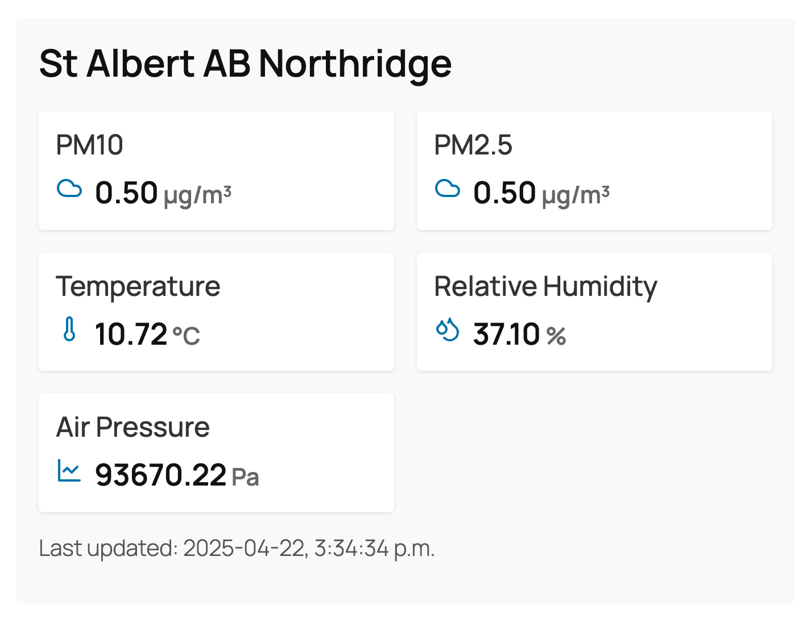
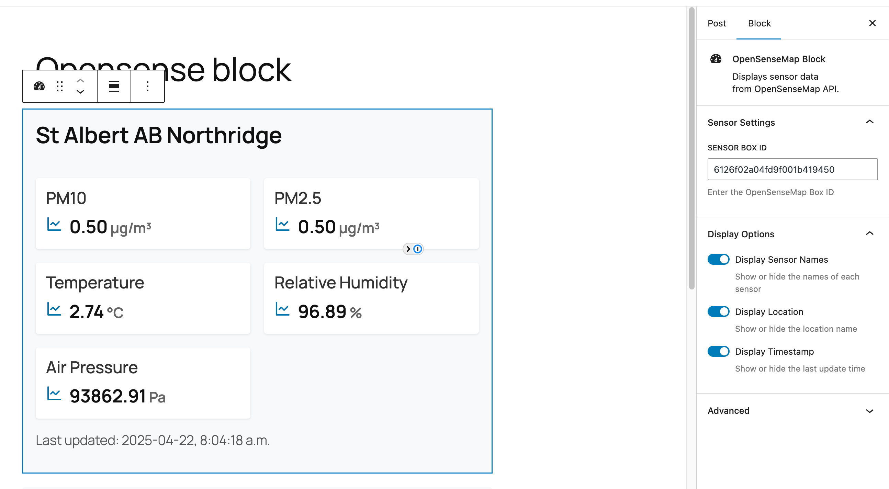

# Opensensemap Block

Display live environmental sensor data from [openSenseMap.org](https://opensensemap.org/) directly in your WordPress site!

## What is openSenseMap?

[openSenseMap](https://opensensemap.org/) is a citizen science platform for publishing and exploring sensor data as open data. Anyone can build their own sensor box (called a senseBox), register it on openSenseMap, and contribute to a global network of environmental measurements. Learn more on their [About page](https://opensensemap.org/about).

Want to build your own sensor? Check out the [sensor.community guides](https://sensor.community/en/sensors/airrohr/) or [senseBox:home DIY instructions](https://sensebox.de/en/).

## Plugin Features

- Display live sensor readings (temperature, humidity, air pressure, and more) from any openSenseMap box
- Customizable display: show/hide sensor names, location, and last update time
- Responsive, modern design
- Easy to use – just add the block and enter a Box ID

## How to Use

1. Add the **OpenSenseMap Block** to any post or page using the WordPress block editor.
2. In the block settings, enter the Sensor Box ID you want to display. (You can find this on [openSenseMap.org](https://opensensemap.org/) by selecting a box and copying its ID from the URL or details panel.)
3. Choose which details to display: sensor names, location, and last update time.
4. Publish or update your post/page. The block will show live data from the selected sensor box!

> **Note:** Data is cached for 5 minutes to reduce API calls. You may see cached data if you reload the page within that window.

## Installation

1. Upload the plugin files to the `/wp-content/plugins/opensensemap-block` directory, or install the plugin through the WordPress plugins screen directly.
2. Activate the plugin through the 'Plugins' screen in WordPress.

## Screenshots

| Example Block | Block Settings |
|:-------------:|:-------------:|
|  |  |

## Links & Resources

- [openSenseMap](https://opensensemap.org/)
- [About openSenseMap](https://opensensemap.org/about)
- [Build your own sensor (sensor.community)](https://sensor.community/en/sensors/airrohr/)
- [Plugin author](https://mikeyarce.com)

## License

GPL-2.0-or-later. See [LICENSE](LICENSE) for details.

---

openSenseMap and senseBox are open-source projects. Learn more and get involved at [openSenseMap GitHub](https://github.com/sensebox/openSenseMap-API) and [senseBox GitHub](https://github.com/sensebox). 